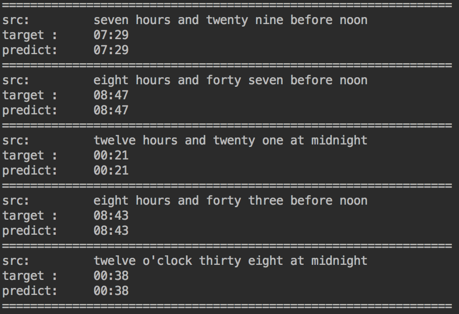
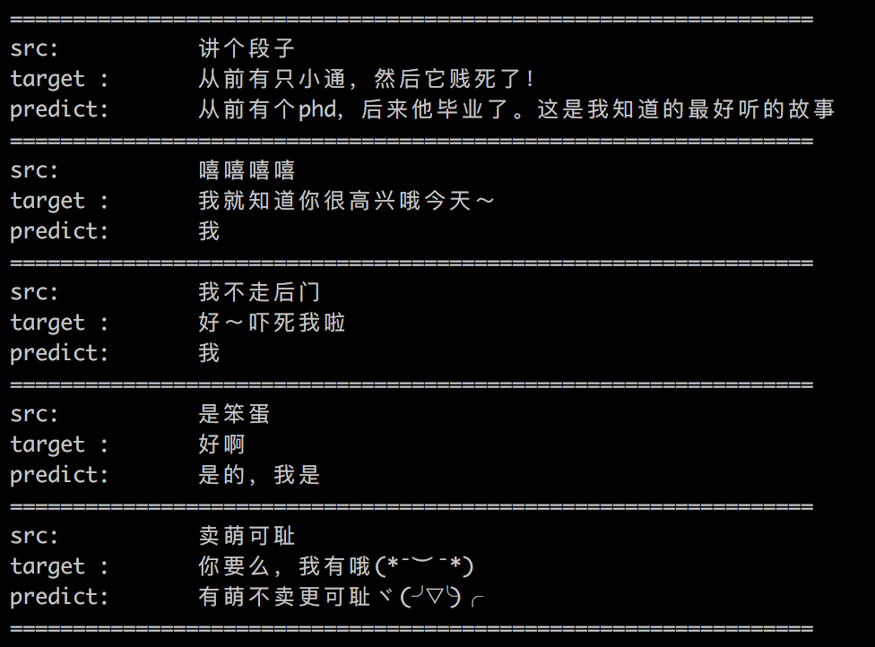

# Time Transformation By S2S

## Description

主要功能：可解决端到端的序列生成任务。代码采用ignite高级框架编写，思路清晰，容易理解。

    代码中的例子：
    1）master分支：时间转换，把时间转化成24小时格式的时间
    例：

    2）develop分支：对话生成，根据上文生成下文
    例：
    

    
   
结构描述：

    ./checkpoint/  : checkpoint文件保存路径 
    ./data/	   : 训练数据
    ./logs/    : 日志文件夹
    ./model/   : 保存模型的文件夹
    ./src/     : 源码文件夹

